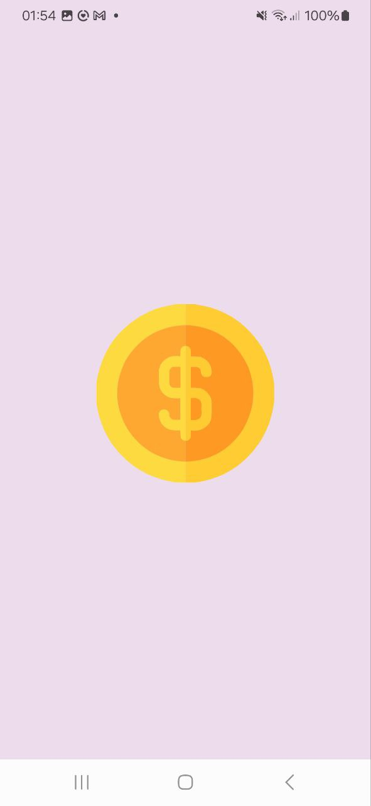
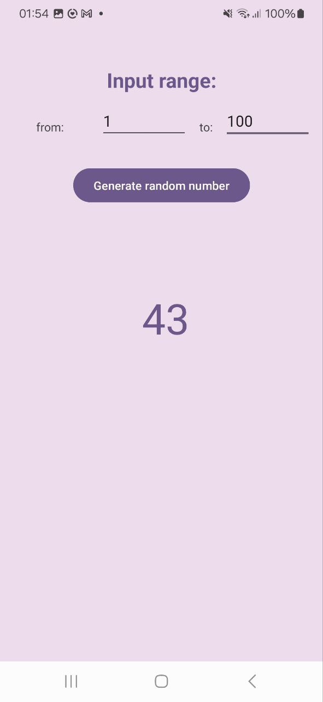
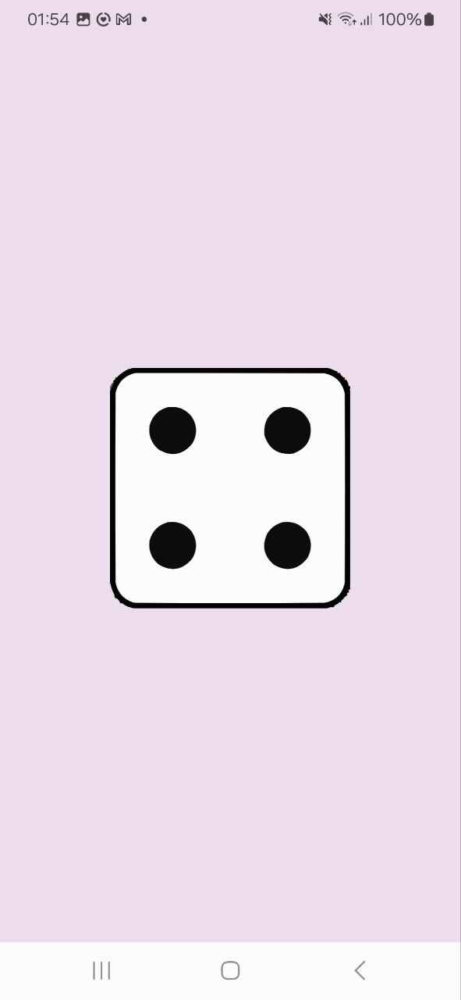
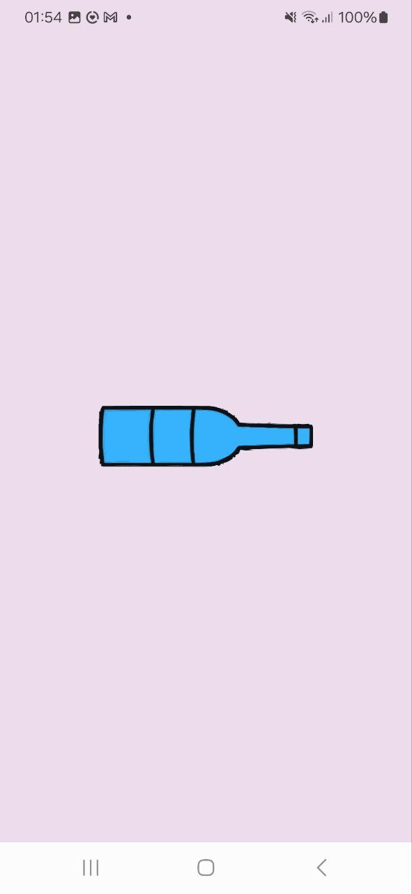

# RandomApp 🎲✨

**RandomApp** is your ultimate fun toolbox for quick decisions, games, and randomness! Perfect for parties, debates, or just get rif of boredom. 

---

## 🚀 Features

| Feature               |Description                                                                 |
|-----------------------|------------------------------------------------------------------------------------|
| **Yes/No/Maybe**    ✅/❌/🤔 | Get instant answers with a cheeky "maybe" twist!                            |
| **Heads or Tails**   🪙      | Flip a virtual coin—perfect for settling bets!                              |
| **Random Number** 🔢         | Generate numbers in any range (e.g., 1-1000).                              |
| **Dice Roll** 🎲             | Roll a classic 6-sided dice for games or decisions.                         |
| **Spin the Bottle** 🍾       | Virtual spin-the-bottle for parties or playful choices! 💃🕺               |

---

## 📸 Screenshots

| Yes/No/Maybe 🌟       | Heads/Tails 🪙        | Random Number 🔢      |
|-----------------------|-----------------------|-----------------------|
|  |  |  |

| Dice Roll 🎲          | Spin the Bottle 🍾     |
|-----------------------|-----------------------|
|  |  |

---

## 🛠️ How to Use

1. **Yes/No/Maybe** 🌈  
   - Tap the button and let fate decide!

2. **Heads or Tails** 🪙  
   - Flip the coin with a single tap!

3. **Random Number** 🔢  
   - Enter your range (e.g., 1-50) and hit *Generate*!

4. **Dice Roll** 🎲  
   - Shake your phone or tap to roll!

5. **Spin the Bottle** 🍾  
   - Spin the virtual bottle and see who it picks! 🎯

---

## 📥 Installation

```bash
git clone https://github.com/userlika/RandomApp.git
```

1. Open the project in Android Studio 📱

2. Build the app 🛠️

3. Run on an emulator or device ▶️

## 💻 Technologies Used

- Java 🦄

- Android Studio 📲

- XML 🎨

- Material Design ✨

## 📧 Contact

Got questions or ideas? Let’s chat! 💬

    Email: likaforjob@gmail.com 📩

    GitHub: @userlika 🐙